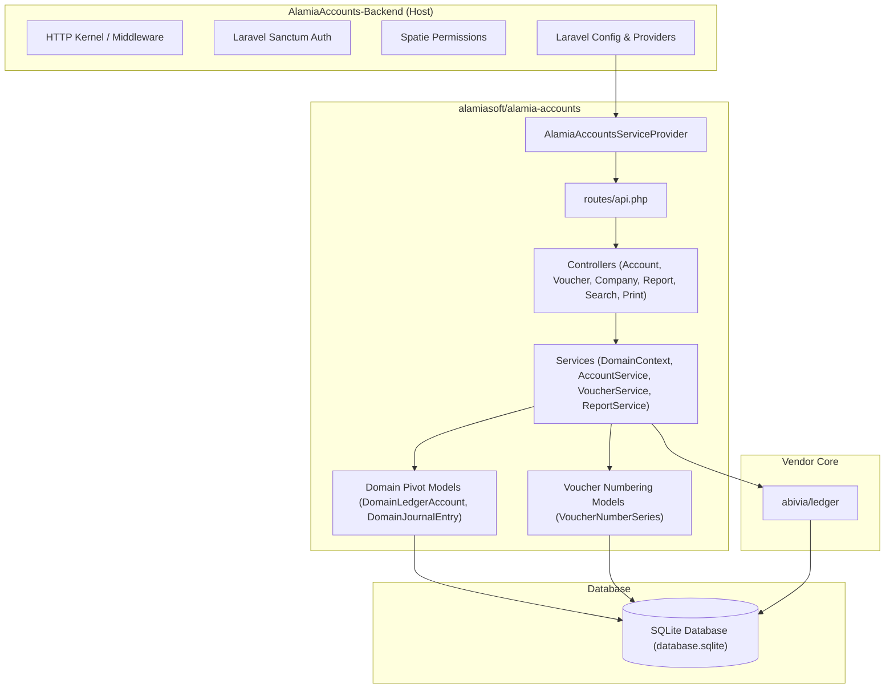

# Backend Dependency Map

```mermaid
graph TD
    subgraph HostApp ["AlamiaAccounts-Backend (Host)"]
        HTTP_Kernel["HTTP Kernel / Middleware"]
        Sanctum_Auth["Laravel Sanctum Auth"]
        Spatie_Perm["Spatie Permissions"]
        Host_Config["Laravel Config & Providers"]
    end

    subgraph Package ["alamiasoft/alamia-accounts"]
        ServiceProvider["AlamiaAccountsServiceProvider"]
        API_Routes["routes/api.php"]
        Controllers["Controllers (Account, Voucher, Company, Report, Search, Print)"]
        Services["Services (DomainContext, AccountService, VoucherService, ReportService)"]
        Pivots["Domain Pivot Models (DomainLedgerAccount, DomainJournalEntry)"]
        Series["Voucher Numbering Models (VoucherNumberSeries)"]
        
        Host_Config --> ServiceProvider
        ServiceProvider --> API_Routes
        API_Routes --> Controllers
        Controllers --> Services
        Services --> Pivots
        Services --> Series
    end

    subgraph Upstream ["Vendor Core"]
        Abivia_Core["abivia/ledger"]
        Services --> Abivia_Core
    end

    subgraph Storage ["Database"]
        SQLite_DB[("SQLite Database (database.sqlite)")]
        Pivots --> SQLite_DB
        Series --> SQLite_DB
        Abivia_Core --> SQLite_DB
    end
```
