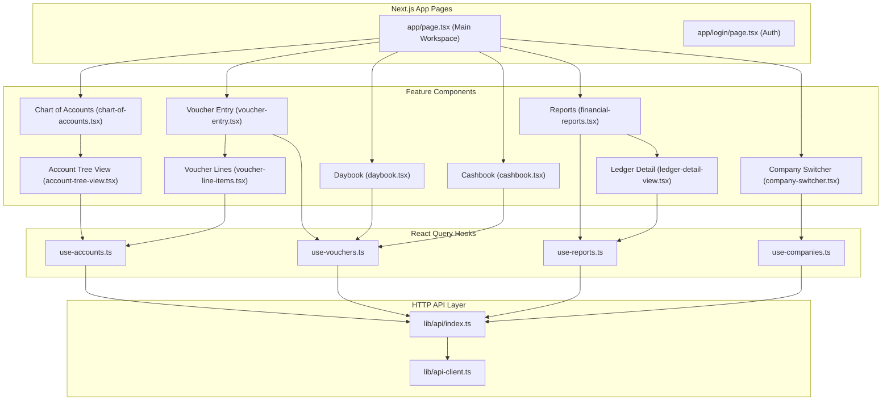

# Frontend Component Dependency Map

```mermaid
graph TD
    subgraph Pages ["Next.js App Pages"]
        Page_Home["app/page.tsx (Main Workspace)"]
        Page_Login["app/login/page.tsx (Auth)"]
    end

    subgraph Components ["Feature Components"]
        CoA["Chart of Accounts (chart-of-accounts.tsx)"]
        Tree["Account Tree View (account-tree-view.tsx)"]
        Voucher["Voucher Entry (voucher-entry.tsx)"]
        Lines["Voucher Lines (voucher-line-items.tsx)"]
        Daybook["Daybook (daybook.tsx)"]
        Cashbook["Cashbook (cashbook.tsx)"]
        Reports["Reports (financial-reports.tsx)"]
        LedgerDetail["Ledger Detail (ledger-detail-view.tsx)"]
        Company["Company Switcher (company-switcher.tsx)"]
        
        Page_Home --> CoA
        CoA --> Tree
        Page_Home --> Voucher
        Voucher --> Lines
        Page_Home --> Daybook
        Page_Home --> Cashbook
        Page_Home --> Reports
        Reports --> LedgerDetail
        Page_Home --> Company
    end

    subgraph Hooks ["React Query Hooks"]
        Hook_Acc["use-accounts.ts"]
        Hook_Vouch["use-vouchers.ts"]
        Hook_Rep["use-reports.ts"]
        Hook_Comp["use-companies.ts"]
        
        Tree --> Hook_Acc
        Voucher --> Hook_Vouch
        Lines --> Hook_Acc
        Daybook --> Hook_Vouch
        Cashbook --> Hook_Vouch
        Reports --> Hook_Rep
        LedgerDetail --> Hook_Rep
        Company --> Hook_Comp
    end

    subgraph Client ["HTTP API Layer"]
        API_Endpoints["lib/api/index.ts"]
        Axios_Client["lib/api-client.ts"]
        
        Hook_Acc --> API_Endpoints
        Hook_Vouch --> API_Endpoints
        Hook_Rep --> API_Endpoints
        Hook_Comp --> API_Endpoints
        API_Endpoints --> Axios_Client
    end
```
