# Alamia Accounts: Front-Office Sales Integration API & User Manual Portal — DAG Roadmap

**Priority**: P0 Sprint  
**Target Capabilities**:
1. **Universal Sales & POS Integration API** (for Front-Office systems like Kamal Express Travel Agency, Retail POS, Clinics).
2. **Accountant Help & User Manual Portal** (Interactive In-App & New-Tab Guide for Finance Teams).

---

## Dependency Graph (DAG)

```mermaid
flowchart TD
    subgraph TrackA["Track A: Front-Office Sales & POS Integration API"]
        A1["Task A1: DB Migration & Models<br/>(operational_sales & operational_sale_items)"]
        A2["Task A2: SalesIntegrationService<br/>(Auto SV- & RV- Double-Entry Orchestration)"]
        A3["Task A3: API Controller & Routes<br/>(POST/GET /api/v1/sales & approve & receipt)"]
        A4["Task A4: Staff Scoping & Idempotency<br/>(Scoping sales per counter agent)"]
        A5["Task A5: Integration Test Suite<br/>(verify_sales_integration_api.php)"]
        A6["Task A6: Standalone HTML POS Client Adapter<br/>(Configure Kamal Express POS UI)"]
        
        A1 --> A2 --> A3 --> A4 --> A5 --> A6
    end

    subgraph TrackB["Track B: Accountant Help & User Manual Portal"]
        B1["Task B1: Backend Manual Aggregation API<br/>(GET /api/manual)"]
        B2["Task B2: Frontend User Manual Component<br/>(components/user-manual.tsx)"]
        B3["Task B3: Interactive Action Buttons & Copilot Prompt Chips"]
        B4["Task B4: Sidebar Navigation Integration<br/>(?page=manual + New Tab Support)"]
        B5["Task B5: Manual E2E Verification & Print Styling"]
        
        B1 --> B2 --> B3 --> B4 --> B5
    end

    TrackA --> Cert["Final Certification (All Test Suites Green & Build Passing)"]
    TrackB --> Cert
```

---

## Track A: Front-Office Sales & POS Integration API

### Task A1: Database Schema & Migration
- [ ] Create migration `create_operational_sales_tables.php`:
  - `operational_sales`: `id`, `company_code`, `client_reference_id`, `created_by_user_id`, `customer_name`, `customer_phone`, `customer_email`, `customer_cnic_or_ntn`, `customer_subledger_code`, `status` (`draft`, `pending_approval`, `posted`, `reversed`), `gross_amount`, `tax_amount`, `net_amount`, `paid_amount`, `balance_due`, `sales_voucher_ref`, `receipt_voucher_ref`, `workflow_mode`, `metadata`, `idempotency_key`, `timestamps`.
  - `operational_sale_items`: `id`, `operational_sale_id`, `description`, `quantity`, `unit_price`, `total_price`, `revenue_account_code`, `tax_rate_percent`, `metadata` (`pnr`, `ticket_number`, `route`, `passenger`, `flight_date`), `timestamps`.
- [ ] Create Eloquent models: `OperationalSale.php` and `OperationalSaleItem.php`.

### Task A2: SalesIntegrationService (Double-Entry Engine)
- [ ] Implement `App\Services\SalesIntegrationService`:
  - Customer Subledger auto-resolution/creation under Accounts Receivable (`1140`).
  - Automated **Sales Voucher (`SV-`)** generation:
    - $Dr$ Accounts Receivable (`1140: Customer`)
    - $Cr$ Revenue (`4100` / `revenue_account_code`)
    - $Cr$ Sales Tax Payable (`2200` if tax applicable)
  - Automated **Receipt Voucher (`RV-`)** generation for immediate payment:
    - $Dr$ Cash in Hand (`1110`) or Bank Account (`1130`)
    - $Cr$ Accounts Receivable (`1140: Customer`)
  - Staging support: If `workflow.mode === 'pending_approval'`, save without posting journal vouchers until approved.

### Task A3: API Controller & Routes
- [ ] Implement `App\Http\Controllers\Api\V1\SalesIntegrationController`:
  - `POST /api/v1/sales`: Create & post sales transaction.
  - `GET /api/v1/sales`: List sales with staff/company scoping.
  - `GET /api/v1/sales/{id}`: Detailed sale summary with voucher links.
  - `POST /api/v1/sales/{id}/approve`: Manager sign-off for pending sales.
  - `GET /api/v1/receipts/{id}/print`: Printable customer receipt HTML/JSON view.

### Task A4: Staff-Level Data Scoping & Idempotency
- [ ] Enforce staff isolation: Counter agents only see their own sales (`created_by_user_id`) unless user has `manager` or `admin` role.
- [ ] Enforce idempotency: Cache/check `Idempotency-Key` or `client_reference_id` to prevent duplicate ticket postings.

### Task A5: Integration Test Suite
- [ ] Create `tests/integration/verify_sales_integration_api.php`:
  - Test 1: Ticket sale with full cash payment $\rightarrow$ verifies `SV-` and `RV-` creation and $Dr = Cr$ ledger balance.
  - Test 2: Ticket sale on credit (0 payment) $\rightarrow$ verifies `SV-` creation and customer AR balance.
  - Test 3: Idempotency duplicate submission prevention.
  - Test 4: Approval workflow (`pending_approval` $\rightarrow$ `/approve` $\rightarrow$ ledger post).
  - Test 5: Staff scoping isolation (Staff A cannot see Staff B sales).

### Task A6: Standalone HTML POS Client Adapter (Kamal Express)
- [ ] Create clean adapter script / HTML POS client demonstrating live connection to Alamia Accounts API, ticket booking entry, staff token auth, and immediate thermal receipt printout.

---

## Track B: Accountant Help & User Manual Portal

### Task B1: Backend Manual Aggregation API
- [ ] Implement `App\Http\Controllers\Api\ManualController`:
  - `GET /api/manual`: Aggregates all manual chapters (`docs/manual/*.md`), standard ERP workflows (`docs/copilot/standard-guidance/*.md`), and active tenant knowledge rules (`copilot_knowledge_entries`).

### Task B2: Frontend User Manual Component
- [ ] Create `components/user-manual.tsx`:
  - Left navigation sidebar with chapter index & categories.
  - Main reading pane with GitHub Flavored Markdown rendering.
  - Search bar for instant full-text filtering across all topics.

### Task B3: Interactive Action Buttons & Copilot Prompt Chips
- [ ] Interactive action buttons: Click "Open Daybook" or "Add Account" to jump to relevant app view.
- [ ] Copilot prompt chips: Click "Ask Taliya" to pre-fill prompt into Copilot chat widget.

### Task B4: Sidebar Navigation Integration
- [ ] Update `components/sidebar.tsx`:
  - Add **"User Manual & Help"** under documentation/help section.
  - Support both in-app tab view (`?page=manual`) and external open in new tab (`target="_blank"`).

### Task B5: Verification & Print Styling
- [ ] Add clean CSS `@media print` styling for physical SOP office printouts.
- [ ] Verify Next.js build and test suites.
